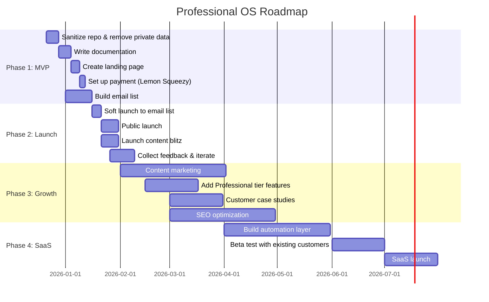

# Product Roadmap

## Visual Roadmap

---

## Phase Details

### Phase 1: MVP Preparation (Dec 21, 2025 - Jan 15, 2026)

**Goal:** Have a sellable product ready for launch

| Week | Focus | Deliverables |
|------|-------|--------------|
| Dec 21-27 | Sanitize | Remove private data, job automation, personal info |
| Dec 28-Jan 3 | Document | Setup guide, schema docs, README |
| Jan 4-10 | Infrastructure | Landing page, payment setup |
| Jan 11-15 | Pre-launch | Email list building, teaser content |

**Exit Criteria:**
- [ ] Repo is clean and ready to sell
- [ ] Documentation complete
- [ ] Landing page live
- [ ] Payment working
- [ ] 100+ email subscribers

---

### Phase 2: Launch (Jan 16-31, 2026)

**Goal:** Validate market with first paying customers

| Week | Focus | Deliverables |
|------|-------|--------------|
| Jan 16-22 | Soft Launch | Email list launch, early feedback |
| Jan 23-31 | Public Launch | Full announcement, content blitz |

**Exit Criteria:**
- [ ] 25+ sales
- [ ] 5+ testimonials
- [ ] <10% refund rate
- [ ] Clear feedback themes identified

---

### Phase 3: Growth (Feb-Apr 2026)

**Goal:** Build sustainable revenue and reputation

| Month | Focus | Deliverables |
|-------|-------|--------------|
| February | Iterate | Fix issues, add requested features |
| March | Content | Blog posts, case studies, SEO |
| April | Expand | Professional tier features, automation |

**Exit Criteria:**
- [ ] 100+ total customers
- [ ] $10k+ total revenue
- [ ] 3+ published case studies
- [ ] Organic traffic growing

---

### Phase 4: SaaS (May-Jul 2026)

**Goal:** Launch recurring revenue product

| Month | Focus | Deliverables |
|-------|-------|--------------|
| May | Build | Job automation, dashboard |
| June | Beta | Test with existing customers |
| July | Launch | Public SaaS launch |

**Exit Criteria:**
- [ ] SaaS product live
- [ ] 50+ subscribers
- [ ] $1k+ MRR

---

## Feature Roadmap by Tier

### Starter ($97) - Launch
- [x] Repository structure
- [x] Profile data schemas
- [x] Basic project tracking
- [x] Resume generation command
- [x] Setup documentation

### Professional ($197) - Feb 2026
- [ ] Content strategy templates
- [ ] LinkedIn post generation
- [ ] Business documentation structure
- [ ] GitHub Actions automation
- [ ] Assessment command

### Complete ($497) - Mar 2026
- [ ] Advanced automation suite
- [ ] Video walkthrough
- [ ] Setup support call
- [ ] Custom schema guide

### SaaS ($19/mo) - Jul 2026
- [ ] Job application automation
- [ ] Interview prep triggers
- [ ] Response tracking
- [ ] Analytics dashboard

---

## Risk Mitigation

| Risk | Mitigation |
|------|------------|
| Low launch sales | Have fallback messaging ready; consider price adjustment |
| High refund rate | Strong documentation; quick support response |
| Competitors copy | Move fast; build community moat |
| Tech issues | Thorough testing; simple architecture |
| Time constraints | Ruthless MVP scope; cut features not quality |

---

## Decision Points

### After Launch Week
- If <10 sales → Revisit pricing and positioning
- If >50 sales → Accelerate Professional tier development

### After Month 1
- If <30 sales → Consider pivoting to different audience
- If >80 sales → Hire contractor for support

### After Month 3
- If <$10k revenue → Re-evaluate product-market fit
- If >$20k revenue → Full commitment to SaaS development
